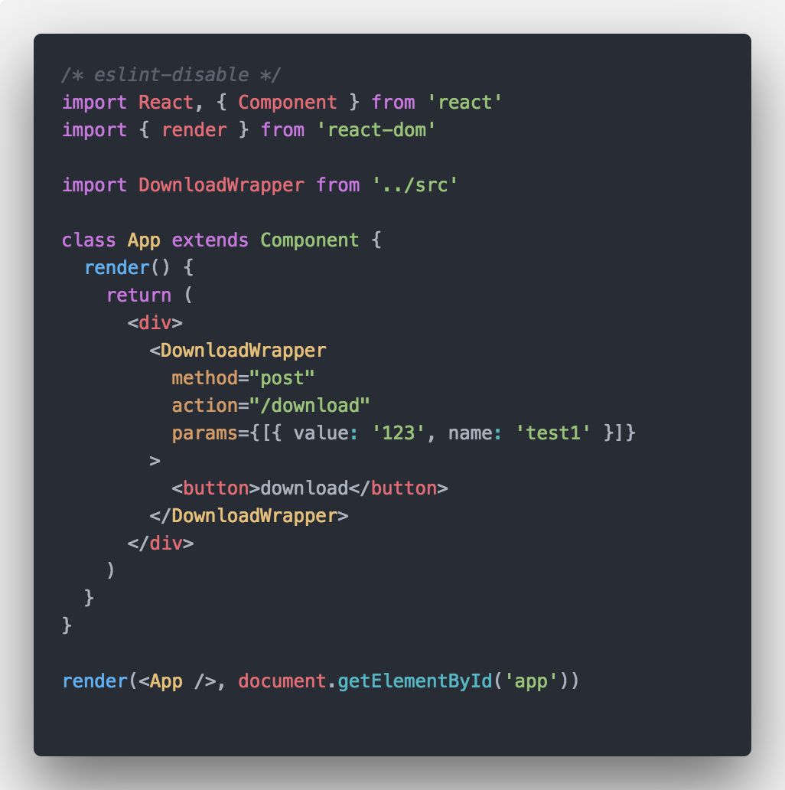

# react-dl-wrapper

[](https://travis-ci.org/Sunshine168/react-download-wrapper)

## Usage

### install
```js
yarn add react-dl-wrapper 
// or npm install react-dl-wrapper -S
// 
```

### import 
```js
import DownloadWrapper from 'react-dl-wrapper'
...
```

## example


## options

### method
 method of form

### action
action of form 

### params
params is an array 

param in array look like
 
```
{
  value:"",
  name:"",
}
```

## MIT

